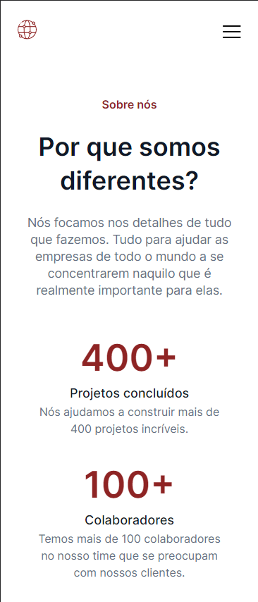
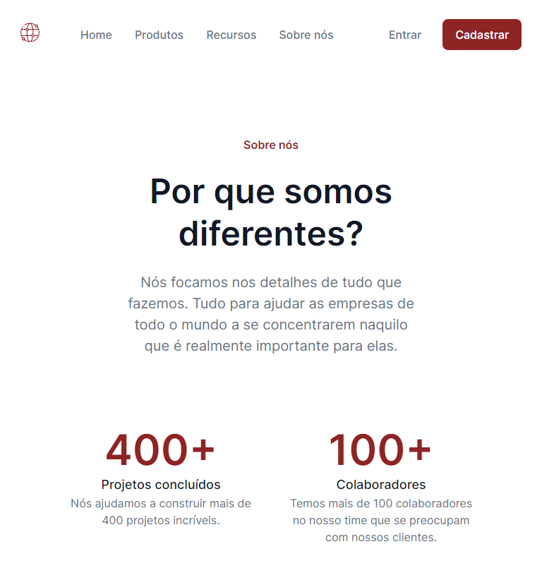
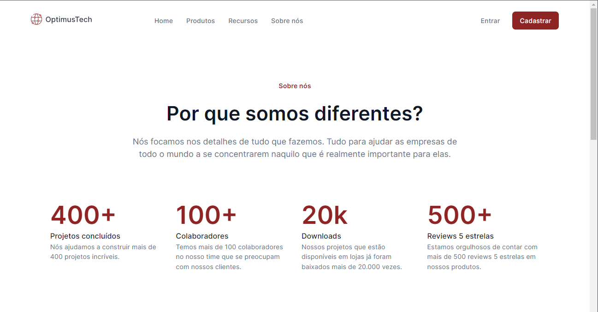

<h1>Optimus Tech | 7 Days Of Code - HTML e CSS</h1>

Repositório com projeto da home estática da empresa fictícia Optimus Tech desenvolvido durante o desafio 7 Days Of Code - HTML e CSS por Giovanna Moeller da Alura Escola Online de Tecnologia. 

<h2>:file_folder: Detalhes do projeto</h2> 

	

 

A aplicação foi desenvolvida com HTML e CSS puro.

Algumas adaptações foram feitas no projeto original com a finalidade de tornar o projeto mais responsivo.

	
	
    

 

<h2>:computer: Tecnologias utilizadas</h2>

	
	

